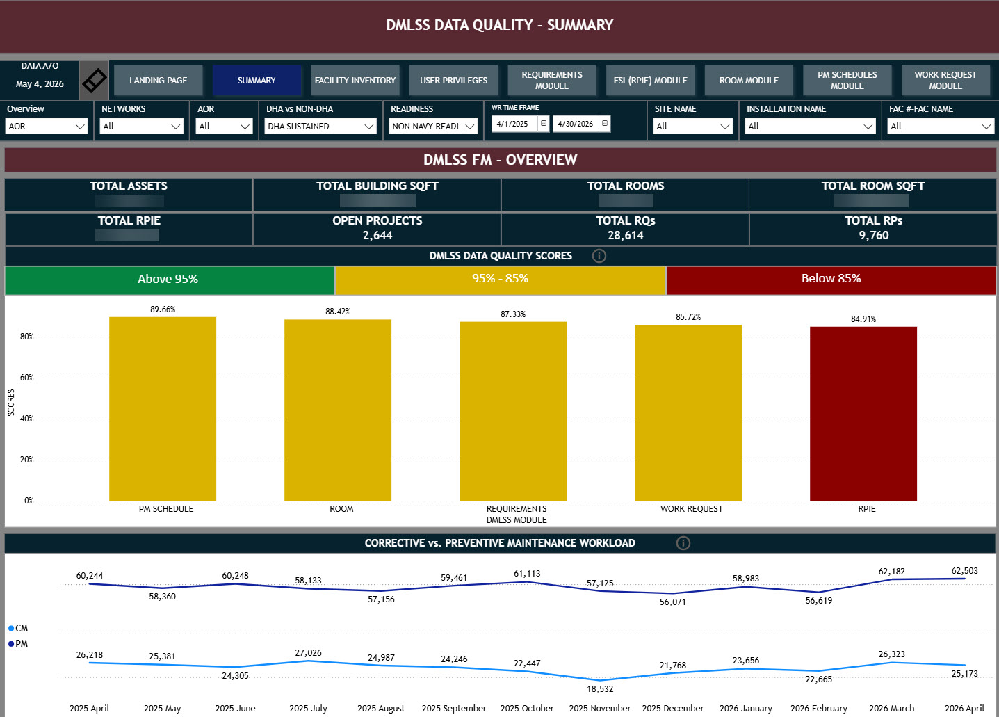

# Enterprise Data Quality Dashboard

## Overview
Operational analytics dashboard designed to monitor and score the data quality of a database, factoring in enterprise and data requirements.

## Key Accomplishments
Leadership required improved visibility into operational performance across multiple organizational levels based on newly established standards and reporting requirements. This Power BI solution allows integrates data from all existing data tables within the sourced database, connecting all using a star schema semantic model. Extensive backend data preparation and transformation were implemented to optimize dashboard performance, streamline reporting logic, and reduce front-end processing complexity. DAX measures and calculated metrics were developed to support KPI tracking, trend analysis, and operational performance reporting across enterprise datasets.

## Technologies
- Power BI
- DAX
- Power Query
- SQL

## Features
- KPI scorecards
- Trend analysis
- Interactive filtering
- Drill-through reporting

## Data Model

This dashboard was designed using a star schema approach, with centralized operational fact tables connected to supporting dimension tables such as facilities, work requests, equipment, rooms, etc. This structure improved dashboard scalability, simplified DAX calculations, and enabled more efficient KPI and trend analysis across enterprise reporting datasets.

This model was developed using Source of Truth exports from our internal database. The model seeks to replicate the Oracle database's relational qualities to enable model development given security restrictions. 

## Executive Overview Page

This page was designed to provide leadership with an interactive view into the enterprise's workload, rates, KPI's, and overall performance metrics that include:
- Completion rates
- Closure trends
- Enterprise performance metrics

