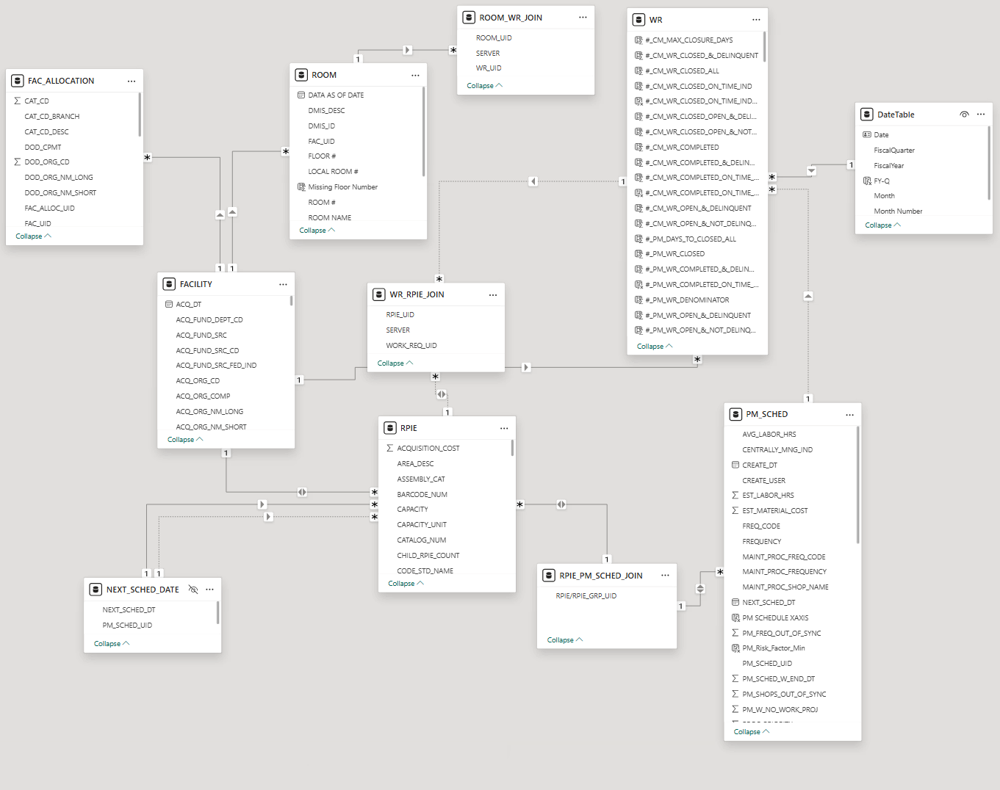
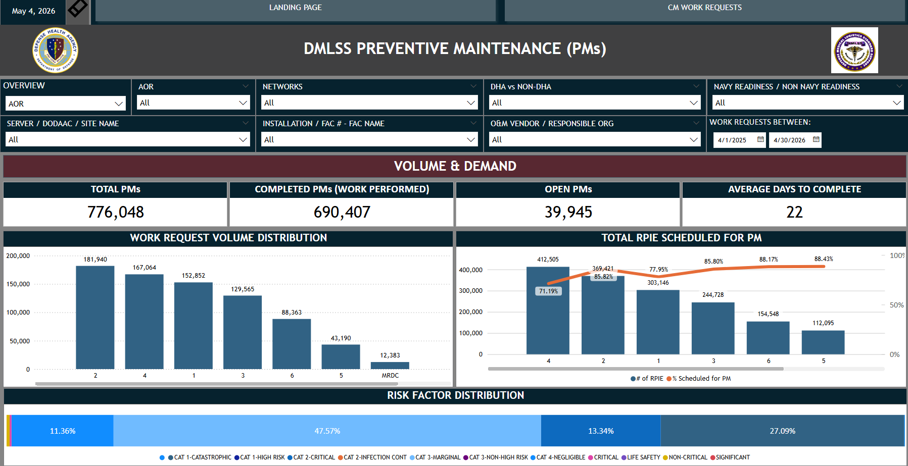
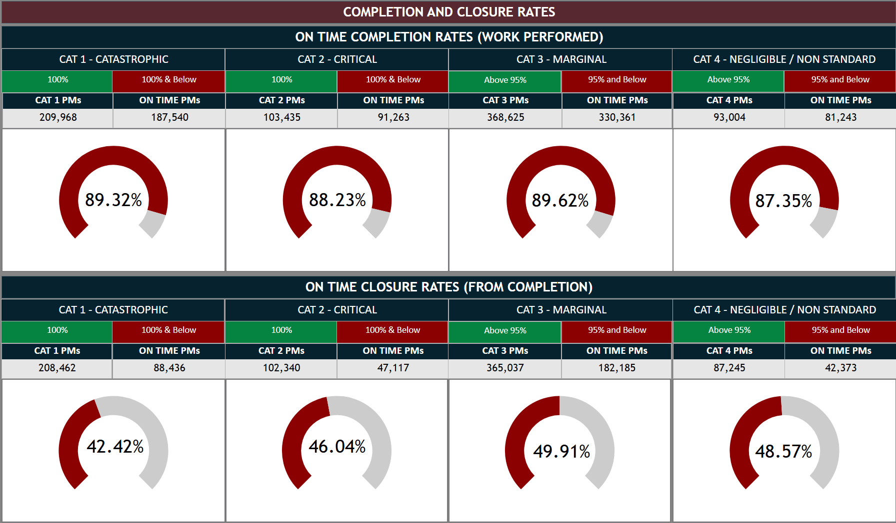
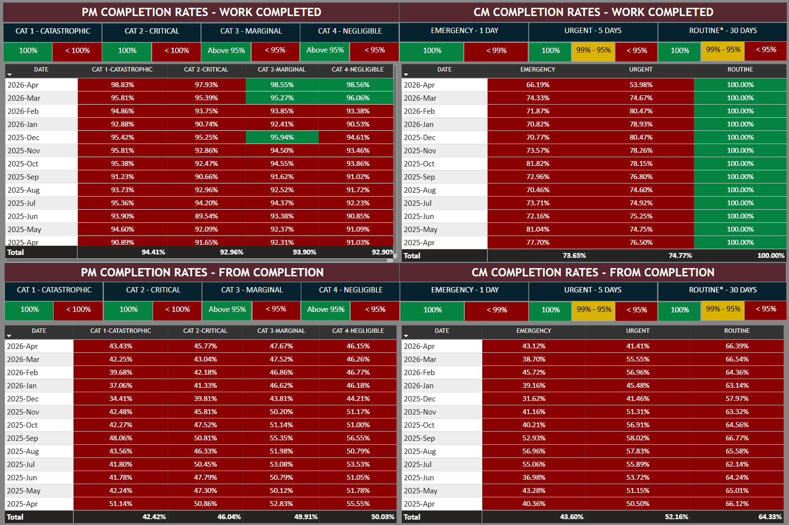
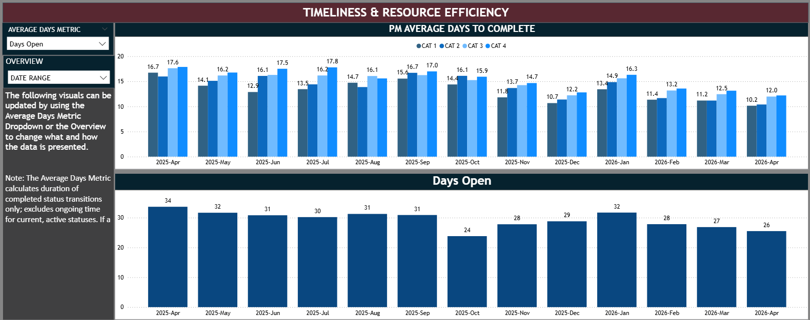

# Enterprise O&M Dashboard

## Overview
Operational analytics dashboard designed to monitor work order completion rates, closure trends, and KPI performance across enterprise facilities operations.

## Technologies
- Power BI
- DAX
- Power Query
- SQL

## Features
- KPI scorecards
- Trend analysis
- Interactive filtering
- Drill-through reporting

## Data Model

This dashboard was designed using a star schema approach, with centralized operational fact tables connected to supporting dimension tables such as facilities, work requests, equipment, rooms, etc. This structure improved dashboard scalability, simplified DAX calculations, and enabled more efficient KPI and trend analysis across enterprise reporting datasets.

This model was developed using Source of Truth exports from our internal database. The model seeks to replicate the Oracle database's relational qualities to enable model development given security restrictions. 

## Executive Overview Page

This page was designed to provide leadership with an interactive view into the enterprise's workload, rates, KPI's, and overall performance metrics that include:
- Completion rates
- Closure trends
- Enterprise performance metrics

## Completion and Closure Rates

To give easily usable and understood Work Request Completion Rate metrics, the following visuals were developed. These give an insight into contract performance and work request rates. Leadership required a way to integrate their high-level requirements into metrics that display overall performance according to developed standards:
 

 

## Resource Efficiency Development

This is a sample of the metrics used to display the resource efficiency of the Work Request O&M (Operations and Maintenance) process. It allows leadership to use dynamic filters developed using DAX measures to view the average times between different stages in the work request process.
 
